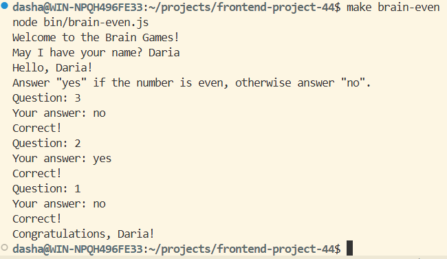
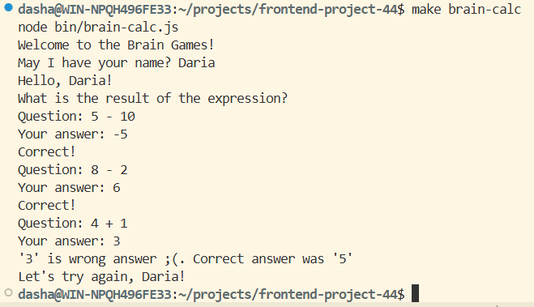
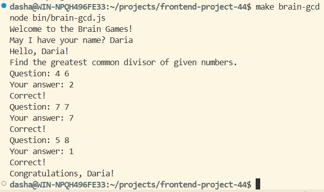
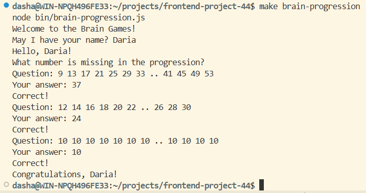
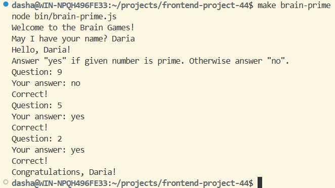

### Hexlet tests and linter status:
[](https://github.com/shkrobadasha/frontend-project-44/actions)
<a href="https://codeclimate.com/github/shkrobadasha/frontend-project-44/maintainability"></a>

Аскинема brain-even: https://asciinema.org/a/BEmP8y24LTgzLaQlyT9fDINIX
Аскинема brain-calc: https://asciinema.org/a/feGtClg6WeBAlHVku90XMpkEc
Аскинема brain-gcd: https://asciinema.org/a/c4EWAT1anTkaFqo1qMV6hmjeW
Аскинема brain-progression: https://asciinema.org/a/KR1POnsMzr1zMzMracbvVWMx6
Аскинема brain-prime: https://asciinema.org/a/AFclE40TLUgL8i8PEp6AzBLKR

Данный проект представляет собой набор консольных игр, направленных на развитие логики и внимания. 

## Игры

### 1. **Проверка на чётность** (`brain-even`)
Необходимо определить, является ли число четным. Варианты ответа `yes` или `no`.

Пример запущенной игры: 

---

### 2. **Калькулятор** (`brain-calc`)
Необходимо решить небольшой математический пример. Доступны операции: `+`, `-`, `*`.

Пример запущенной игры: 

---

### 3. **НОД** (`brain-gcd`)
Необходимо найти НОД двух чисел.

Пример запущенной игры:

---

### 4. **Арифметическая прогрессия** (`brain-progression`)
Необходимо определить пропущенное число в арифметической прогрессии.

Пример запущенной игры: 

---

### 5. **Простое ли число?** (`brain-prime`)
Необходимо определите, является ли число простым. Варианты ответа `yes` или `no`.

Пример запущенной игры: 

---

## Установка и запуск

1. Склонируйте репозиторий:
```bash
git clone git@github.com:shkrobadasha/frontend-project-44.git
```
2. Перейдите в директорию проекта:
```bash
cd frontend-project-44
```
3. Установите необходимые зависимости:
```bash
make install
```
4. Запустите выбранную игру:

```bash
make brain-even  # (brain-calc/brain-gcd/brain-progression/brain-prime)
```
